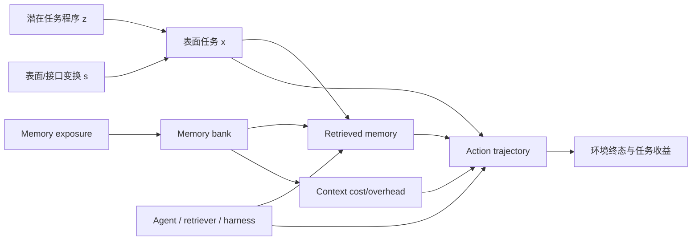

# CausalMemAgent 技术报告（第二版）

## Agent memory 学到的是可迁移经验，还是只检索了相似轨迹？

**版本日期：** 2026-08-07  
**适用资源：** 6–8 × NVIDIA RTX A5000 24GB  
**目标：** 在最新 Agent memory 文献基础上，判断该方向是否仍有顶会潜力，并给出可直接执行的研究路线  
**潜在投稿：** ACL / EMNLP 主会；理论与跨分布结果充分时可投 ICML / NeurIPS / ICLR

---

## 摘要

Agent memory 研究已经从“保存聊天记录”发展到动态的 experience extraction、workflow induction、memory update、selective forgetting、reinforcement learning 和跨域 skill transfer。Reflexion、ExpeL、Agent Workflow Memory、Memp、MemoryAgentBench、LifelongAgentBench、Memory-R1、AgeMem 等工作已经证明：外部 memory 能够提高语言 Agent 的任务表现。但这些提升并不能自动证明 Agent 学到了可迁移经验，因为 exact/near-exact trajectory replay、表面相似性、领域熟悉、额外上下文、检索器质量、基础模型差异以及 benchmark 泄漏都可能产生相同的结果。

截至 2026 年 8 月，宽泛地提出“memory retrieval 应优化实际 utility 而不是 similarity”已不足以构成顶会创新：Memory Transfer Learning 已研究不同抽象层级的跨域迁移；MCMA 已学习 memory abstraction hierarchy 与跨任务复用；AFTER 已评测跨任务、跨角色、跨模型的 procedural skill transfer；ReMe 已包含 utility-based refinement；Memory Transplants 用 factorial design 分离 architecture 与 content transfer；MemDelta 揭示 embedding、模型和成本等评测混淆；Bridge Evidence 使用删除干预定义 agentic retrieval 的 counterfactual trajectory utility。

本报告的结论是：**该方向仍有顶会潜力，但论文必须从“设计更好的 memory”升级为“识别 memory 的迁移机制”。** 建议将项目重新定义为：

> **CausalMemAgent：在具有 evaluator-only 潜在程序 oracle 的 matched task families 上，通过正交随机干预，识别 observed memory gain 中的 program match、surface similarity、domain/interface/version match、exact replay 与 retrieval/context 成分；随后学习一个完全不读取 oracle 标签、只根据可观测证据估计 transportable utility 的 memory policy。**

建议的核心产物包括：

1. **CausalMemBench**：具有 evaluator-only 程序 oracle、等价程序类和正交 treatment generator 的 Agent memory 测试床；
2. **Factorial Memory Effect Decomposition（F-MED）**：以 Program Match × Surface Similarity 为主析因设计，并将 exact、domain、interface、freshness 作为嵌套或分层扩展因素；
3. **Transportable Robust Utility Memory（TRU-Mem，暂定名）**：利用 oracle-free、跨变换的因果收益决定 memory 接纳和调用；
4. 一个核心经验结论：现有 memory 方法的增益中有多少来自 exact replay/表面匹配，多少能跨实体、接口、环境和任务表述迁移；
5. 可选理论：risk-controlled memory admission under transformation shift；基础 identifiability 命题只作为实验设计支撑，不把教科书式随机化结论包装成主要理论贡献。

如果只完成现有方法横评，预期为 Findings/Workshop；若完成正交 benchmark、核心经验分解、oracle-free TRU-Mem 和真实环境验证，具备 ACL/EMNLP 主会潜力；若再给出非平凡的 distribution-shift risk guarantee、safe online admission 或 transportability learning result，才适合优先冲击 ICML/NeurIPS。论文叙事必须以 measurement 与 identification 为第一贡献，TRU-Mem 为由实证发现驱动的第二贡献。

---

## 1. 首先澄清：Agent memory 到底是什么

“Agent memory”至少包含四种不同对象，混在一起会导致错误实验设计。

### 1.1 Working/context memory

同一次 episode 中的近期观察、计划和工具结果。研究重点是 context management、compression 和 long-horizon reasoning。它解决“当前轨迹太长”的问题，不等于跨 episode 学习。

### 1.2 Episodic memory

保存过去任务的原始或压缩轨迹：

\[
m^{epi}=(x, a_{0:T}, o_{1:T}, y, r).
\]

它最容易产生 exact replay 和近邻模仿，也最容易保留可验证证据。

### 1.3 Semantic memory

从多个 episode 中抽取事实、环境规律或概念关系。例如“退款需要订单号与付款凭证”。它可能具备跨任务泛化，但抽取和合并会引入幻觉。

### 1.4 Procedural memory / skill

抽取可以重复执行的 workflow、策略或程序：

\[
m^{proc}=(\text{precondition},\text{plan},\text{tool bindings},
\text{postcondition},\text{failure guards}).
\]

这最接近“从经验中学到了技能”的主张，也是 CausalMemAgent 的核心研究对象。

### 1.5 本项目不研究什么

- 不把模型参数中的 pretraining memorization 称为 Agent memory；
- 不以聊天事实问答作为主要任务；
- 不仅研究“能否检索到正确文本”；
- 不把单次 episode 内的长上下文压缩作为主要创新；
- 不把 memory 数据库工程替换当成科学贡献。

项目研究的是：**过去 episode 形成的外部记忆，是否对新的可执行任务产生可迁移的因果收益。**

---

## 2. 文献脉络：从反思到可学习 memory policy

### 2.1 第一阶段：保存失败并进行语言反思

[Reflexion](https://papers.nips.cc/paper_files/paper/2023/hash/1b44b878bb782e6954cd888628510e90-Abstract-Conference.html) 将环境反馈转化为 verbal reflection，保存在 episodic buffer 中供后续尝试使用。它证明无需更新参数也能通过文本 memory 改善行为，但主要关注同一或类似任务上的迭代改进，没有严格分离 replay 与 transfer。

[ExpeL](https://arxiv.org/abs/2308.10144) 从训练任务的多条经验中抽取自然语言 insights，并在推理阶段检索 past experiences。它明确提出 experiential learning 和 transfer，但迁移证据主要来自任务级结果，没有随机化的等价任务族来识别迁移机制。

### 2.2 第二阶段：workflow 与 procedural memory

[Agent Workflow Memory](https://proceedings.mlr.press/v267/wang25bx.html) 从 WebArena 和 Mind2Web 轨迹中诱导 workflow，报告显著的跨任务、网站和领域增益，说明结构化过程知识可能比原始轨迹更可复用。

[Memp](https://arxiv.org/abs/2508.06433) 系统研究 procedural memory 的 Build、Retrieval 和 Update，并比较 step-level instructions 与 script-like abstraction；其结果支持 procedural memory 可跨模型迁移。

[ProcMEM](https://arxiv.org/abs/2602.01869) 使用 non-parametric PPO 学习可复用 procedural memory；2026 年的多项工作继续采用 RL 优化 memory 的写入、更新和调用。

[MCMA](https://aclanthology.org/2026.findings-acl.1535/)（ACL 2026 Findings）把 memory abstraction 视为可学习的 meta-cognitive skill：冻结 task model，以 DPO 训练 memory copilot，组织多层抽象 memory，并测试 OOD 与 cross-task transfer。因此，“学习 memory 的抽象层级”不能再作为本项目的核心 novelty。

这些工作回答了“怎样构建 procedural memory”，但通常没有回答：增益是因为 memory 表示了潜在程序，还是因为新任务在表面上接近旧任务。

### 2.3 第三阶段：memory benchmark 与 lifelong learning

[MemoryAgentBench](https://arxiv.org/abs/2507.05257) 在 ICLR 2026 系统评估 accurate retrieval、test-time learning、long-range understanding 和 selective forgetting，将输入逐步注入 memory，而非一次性提供完整上下文。

[LifelongAgentBench](https://arxiv.org/abs/2505.11942) 通过 Database、Operating System 和 Knowledge Graph 环境评估技能获得、迁移和保持，并发现普通 experience replay 会受到无关信息和 context length 的影响。

[Mem2ActBench](https://arxiv.org/abs/2601.19935) 将 memory 评测从事实回答推进到 tool selection 与 parameter grounding，揭示当前系统即使检索到相关历史，也不一定能主动使用 memory 完成行动。

[AFTER](https://arxiv.org/abs/2606.23127) 提供 382 个 enterprise tasks、6 个角色与 22 类 procedural skills，专门评测 local improvement、cross-task、cross-role 与 cross-model transfer。因此，仅构建“procedural memory transfer benchmark”也不足以形成主贡献。

这些 benchmark 证明 memory evaluation 必须是 incremental、interactive 和 action-grounded；但它们仍主要测“表现是否更好”，没有为 exact replay、结构迁移和领域熟悉提供完整的 randomized ground truth。

### 2.4 第四阶段：主动 memory management 与 RL

[Memory-R1](https://aclanthology.org/2026.acl-long.583/) 使用 RL 训练 Memory Manager 执行 ADD、UPDATE、DELETE 和 NOOP，同时训练 Answer Agent 预选 memory；其结果显示 3B–14B 模型仅用少量训练样本也能学会 memory operations。

[Agentic Memory / AgeMem](https://aclanthology.org/2026.acl-long.981/) 将 LTM 与 STM 操作直接纳入 Agent policy，通过多阶段 RL 学习何时保存、检索、更新、总结和丢弃。

[HiMPO](https://arxiv.org/abs/2606.16285) 指出 long-horizon outcome reward 会把下游工具错误归因给 memory write，使用 local counterfactual utility 和 hindsight relevance 减少 credit entanglement。

[AttriMem](https://arxiv.org/abs/2607.21106) 使用 token-level attribution 为 memory-construction policy 提供局部 process reward。

[ReMe](https://aclanthology.org/2026.findings-acl.829/)（ACL 2026 Findings）已经联合研究 memory distillation、context-adaptive reuse 与 utility-based refinement，并在 BFCL-V3 和 AppWorld 上评估。因此，utility-based admission/pruning 只能作为 baseline 或组成模块，不能作为 TRU-Mem 的核心声明。

因此，“训练一个 memory gate/controller”本身也不够新；必须证明它优化了此前没有被正确识别的目标。

### 2.5 第五阶段：transfer、negative transfer 与评测混淆

[Memory Transfer Learning](https://arxiv.org/abs/2604.14004) 在六个 coding benchmarks 上比较 trajectory、workflow、summary 和 insight，发现跨域 memory 平均提升约 3.7%，且高层 meta-knowledge 比低层具体轨迹更容易迁移，后者可能产生 negative transfer。

ICLR 2026 MemAgents Workshop 的 [Memory Transplants](https://openreview.net/attachment?id=AIJsjIqfsp&name=pdf) 通过 2×2 factorial design 分离 memory architecture 与 content transfer，发现跨 code→math 的静态 content transfer 收益有限、negative transfer 常见，弱模型的 memory effect 更大。

[When Continual Learning Moves to Memory](https://arxiv.org/abs/2604.27003) 表明 stability–plasticity dilemma 并未消失，而是转移到 memory representation 与 retrieval；forward transfer 更强的设计也可能产生严重遗忘。

[More Skills, Worse Agents?](https://arxiv.org/abs/2605.24050) 将大型 skill library 的下降分解为 skill shadowing 与 context overhead，发现选择错误是主要瓶颈。

[Useful Memories Become Faulty](https://arxiv.org/abs/2605.12978) 发现连续 consolidation 的 utility 会先升后降，即使输入是正确轨迹，重写过程也可能损坏 memory；保留 episodic evidence 的简单策略有时优于强制 consolidation。

[MemDelta](https://arxiv.org/abs/2606.29914) 进一步表明 memory 系统比较常混入 answer model、embedding model、retrieval pipeline 和 write cost；只替换 embedding model 就可能改变结论。

这组工作直接抬高了 CausalMemAgent 的门槛：不能只报告 memory gain 或 negative transfer，而要识别它们的来源。

### 2.6 第六阶段：counterfactual utility 已经出现

[Bridge Evidence](https://arxiv.org/abs/2607.15253) 对 agentic search 中读取的文档做删除与 replay，提出 Counterfactual Trajectory Utility，并发现静态 relevance 与动态因果 utility 几乎独立。

[MemAudit](https://arxiv.org/abs/2605.23723) 使用 counterfactual memory influence 定位导致有害行为的 poisoned memories。

Decision-aware memory cards、HiMPO 和 AttriMem 也分别使用 outcome uplift、local counterfactual utility 或 attribution 信号。

所以本项目不能把“对 memory 做删除干预”或“训练 utility predictor”作为唯一创新。真正尚未解决的是：

> **一条 memory 的 utility 是否能跨语义保持的表面与接口变换迁移，以及现有 memory gain 中 exact replay、结构迁移和领域熟悉各占多少。**

---

## 3. 现有工作已回答与未回答的问题

| 问题 | 当前状态 | 仍缺什么 |
|---|---|---|
| 外部 memory 能否提高表现 | 已充分证明 | 不再是新问题 |
| workflow/abstract insight 是否优于 raw trace | Memp、MCMA 等已有较强证据 | 缺少严格 matched latent program 控制 |
| memory 是否会 negative transfer | 已证明 | 缺少机制分解与可靠接纳规则 |
| retrieval similarity 是否等于 utility | 已有反例 | 缺少跨任务 family 的 transportable utility |
| architecture 与 content transfer | 已有 workshop factorial study | 缺少 item/family 级的 exact–structural–domain 分解 |
| memory benchmark 是否有 pipeline confounds | 已被 MemDelta 指出 | 缺少统一的随机化因果协议 |
| memory 是否能驱动工具行动 | Mem2ActBench 已覆盖 | 缺少真实执行后的 end-state causal effects |
| procedural memory 是否跨任务/角色/模型迁移 | AFTER、MCMA、Memory Transfer 等已覆盖 | 缺少 observed gain 的析因分解 |
| utility-based admission/pruning | ReMe、HiMPO 等已覆盖 | 缺少 transformation-robust、risk-controlled 目标 |
| memory write 如何获得 credit | HiMPO/AttriMem 已推进 | 缺少“对未见变换仍有用”的训练目标 |
| memory consolidation 是否可靠 | 已发现会退化 | 缺少 evidence-preserving、跨变换验证的 admission |
| benchmark 成功是否来自 exact/near replay | 基本未系统识别 | **本项目核心空白** |

---

## 4. 顶会潜力判断

### 4.1 原始版本为什么不够

以下版本在 2026 年大概率只能投 Findings/Workshop：

- 比较 no-memory、RAG、workflow memory；
- 展示“相似度高不等于有用”；
- 对 memory 做 leave-one-out deletion；
- 训练一个预测 memory utility 的小模型；
- 报告 negative transfer；
- 在 ALFWorld/TravelPlanner 上提高若干成功率。

这些贡献分别与 MemDelta、Bridge Evidence、MemAudit、Memory Transfer Learning、HiMPO/AttriMem、Memp/AWM 高度重合。

### 4.2 仍有主会价值的版本

顶会级问题应该改写为：

> 给定一组表面不同、潜在程序相同或相近的可执行任务，能否通过随机实验识别 memory 的 exact replay premium、structural transfer、domain familiarity、retrieval selection 与 context overhead？能否只保存和加载在未见过的同构任务上仍有正效用的 memory？

这个版本的独特性来自四点：

1. **新的识别目标**：不是“memory 是否有用”，而是“utility 是否由可迁移结构造成”；
2. **新的 ground truth**：任务生成器知道 latent program 和变换关系，但这些标签严格只对 evaluator 可见；
3. **新的随机协议**：memory content 与 retrieval 被分别干预；
4. **新的优化目标**：跨 sibling/intervention 的 robust utility，而不是当前 item 的 outcome 或 attribution。

### 4.3 现实判断

- **ACL/EMNLP 主会：有较强潜力。** 条件是 benchmark、因果分解、新方法和真实环境验证缺一不可。
- **ICLR：存在条件性潜力。** 需要展示 memory representation、模型能力与 OOD transportability 的系统规律，而不仅是增加一个 benchmark。
- **ICML/NeurIPS：当前基础版不应优先投。** aggregate non-identifiability、随机化可识别性和普通 Hoeffding/LCB 都过于直接；至少需要 risk-controlled admission under shift、safe online learning 或新的 transportability learning result。
- **仅 benchmark：风险较高。** 2026 年 memory benchmark 已很多，必须有明确的新构念与可靠性证据。
- **仅方法增益：风险很高。** reviewer 会认为增益来自 prompt、retriever 或额外 token。

综合判断：建议立项，但必须从第一天就按随机化因果研究设计，而不是先做一个 memory architecture 再补实验。

### 4.4 贡献顺序必须调整

建议论文贡献按以下顺序陈述：

1. **Problem：** higher memory-augmented accuracy 不是 transferable experience 的证据；
2. **Benchmark/identification：** 用可执行正交任务族识别 gain 的组成；
3. **Empirical discovery：** 比较不同 memory systems 的 exact、surface-trap 与 structural profiles；
4. **Method：** 根据发现提出 oracle-free transportable-utility gate；
5. **Optional theory：** 对负迁移风险或在线接纳给出真正有内容的保证。

如果论文以“We propose another memory architecture”开场，MCMA、ReMe、Memp、ProcMEM 等会使 novelty 显得很弱；如果以“现有 memory benchmark 是否把 replay 当成 learning”开场，问题定位明显更强。

---

## 5. 推荐论文框架：CausalMemAgent

### 5.1 总体因果图



观察到 memory 后的成功率提高，并不能区分 \(B\to R\to A\to Y\) 中的哪一段起作用。CausalMemAgent 通过分别随机化 exposure、retrieval 和 representation 来识别不同路径。

### 5.2 四个研究问题

**RQ1：Decomposition**  
控制 context 后，Program Match、Surface Similarity 及其 interaction 如何构成 observed memory gain？exact exposure 与 domain/interface/version shifts 又如何改变这些效应？

**RQ2：Mechanism**  
negative transfer 主要来自错误检索、错误 memory 内容、过度具体的表示，还是 consolidation 对证据的损坏？

**RQ3：Transportability**  
在原任务上有用的 memory，是否在实体重命名、工具 schema 改写、状态变化和未见领域中仍然有用？

**RQ4：Method**  
能否仅基于可观测 task transformations 与 randomized rollout labels 学习 transportable utility，在不读取 latent-family oracle 的条件下降低 negative transfer？

### 5.3 预注册主假设

- H1：exact memory 的收益显著高于 same-program/different-surface memory；
- H2：控制 token、领域和检索后，现有方法的 structural transfer 显著低于其报告的 total memory gain；
- H3：embedding similarity 与 structural causal utility 的相关性较低；
- H4：near-miss memory——表面相似但潜在程序不同——是 negative transfer 的主要来源；
- H5：抽象 workflow 的 average transfer 高于 raw trajectory，但错误 abstraction 的尾部风险更大；
- H6：oracle-free、跨可观测变换校准的 TRU-Mem 比 item-level utility gating 更稳健；
- H7：弱模型具有更大的 exact replay premium，但未必具有更大的 structural transfer；
- H8：接口改变会显著削弱低层 trajectory memory，对 invariant workflow memory 影响较小。

---

## 6. CausalMemBench：数据与环境设计

### 6.1 设计原则

每个 benchmark item 不是孤立问题，而属于一个仅由 evaluator 知道的潜在程序家族：

\[
\mathcal F_z=\{x_{z,1},x_{z,2},\ldots,x_{z,K}\}.
\]

同一 \(\mathcal F_z\) 的任务在解法结构上等价，但表面实体、文本和工具接口可以变化。另设 near-miss family \(\mathcal F_{z'}\)，其文本非常相似但关键前置条件或动作顺序不同。

### 6.2 潜在 workflow DSL

为保证 ground truth，先定义一个小型 workflow DSL：

```text
GOAL          := predicate(target_state)
READ          := tool(entity, fields)
CHECK         := predicate(observation)
BRANCH        := if predicate then plan_a else plan_b
WRITE         := tool(entity, mutation)
VERIFY        := predicate(new_state)
ROLLBACK      := compensation(action)
ASK           := request_missing(parameter)
```

任务生成器先采样 latent program specification，再渲染成自然语言任务、工具 schema 和初始数据库状态。但 structural equivalence 不能被定义为“唯一最优 DAG 完全相同”，因为实际 Agent task 往往存在多个合法动作顺序。

本项目把一个程序类定义为：

\[
z=(G_{\mathrm{prec}},C_{\mathrm{safety}},C_{\mathrm{terminal}},B_{\mathrm{recovery}}),
\]

其中 \(G_{\mathrm{prec}}\) 只规定必要的 partial-order dependencies，\(C_{\mathrm{safety}}\) 是必须满足的安全约束，\(C_{\mathrm{terminal}}\) 是合法终态，\(B_{\mathrm{recovery}}\) 是必要的错误恢复条件。所有满足这些约束的 workflow 构成等价类：

\[
\Pi(z)=\{\pi:\pi\models G_{\mathrm{prec}},C_{\mathrm{safety}},C_{\mathrm{terminal}},B_{\mathrm{recovery}}\}.
\]

两个任务被标为 program match，当且仅当它们对应同一等价类，而不是要求 action sequence 逐步相同。这样允许 \(A\rightarrow B\rightarrow C\) 与 \(B\rightarrow A\rightarrow C\) 在 \(A,B\) 无依赖时都合法。

### 6.2.1 Oracle 隔离铁律

\[
\boxed{z,\;\text{family ID},\;\text{transformation ID},\;\text{near-miss label}\quad\text{are evaluator-only}}
\]

- benchmark generator 将私有 oracle graph 与公开 task view 分开保存；
- Agent/TRU-Mem 只能看到 task text、tool schema、当前 state、历史 trajectory 和普通 provenance；
- utility model 的输入不得出现 family/program/transformation ID，也不得出现由其直接编码的 feature；
- evaluator 可以用 oracle 组织随机实验、计算 estimand 和审计结果，但不能把 label 注入 prompt、memory card 或 retriever；
- 额外报告一个 oracle upper bound，但它不能作为主方法；
- 发布时提供 sealed evaluator 或分离的 hidden test generator，避免方法通过文件结构恢复 family ID。

方法可以从可观测信息中学习 \(\hat z(x)\)，但 ground-truth \(z\) 只用于评价 \(\hat z\) 是否真的捕获了程序结构。

### 6.3 三个受控环境

#### Environment A：RelationalOps

使用本地 SQLite/JSON 状态实现 CRM、日历、库存和工单任务。典型任务需要先读取多个表、解析实体、检查约束，再执行写操作并验证。

可控制：join 深度、missing field、权限、重复实体、时间条件和 distractor records。

#### Environment B：TransactionalTools

模拟订单、退款、订阅、预约和审批流程。重点测试：

- 动作顺序；
- idempotency；
- 前置授权；
- 写后验证；
- 环境版本变化；
- obsolete workflow。

#### Environment C：FunctionDAG

每个工具是隐藏函数 DAG 中的一条边，工具输出作为后续工具输入。通过重命名函数、交换等价参数、拆分/合并工具，测试真正的程序性迁移。

### 6.4 外部效度环境

至少选择两个：

- ALFWorld：任务族清晰、运行成本低；
- TravelPlanner：适合 procedural constraints；
- ToolSandbox：stateful 与 milestone evaluator；
- AppWorld 子集：真实 API 组合，但运行更昂贵；
- LifelongAgentBench：DB/OS/KG 的技能迁移。

外部 benchmark 不承担核心因果 ground truth，只验证关键规律是否能迁移到非合成环境。

### 6.5 可干预因素

定义 memory \(m\) 与测试任务 \(x\) 的关系向量：

\[
W=(P,S,D,I,V,E),
\]

其中：

- \(P\in\{0,1\}\)：latent program equivalence class 是否匹配；
- \(S\in\{0,1\}\)：表面相似度低/高，按预先校准的 lexical 与 semantic nuisance measures 构造；
- \(D\in\{0,1\}\)：领域是否匹配；
- \(I\in\{0,1\}\)：工具接口、参数命名和 schema 是否匹配；
- \(V\in\{0,1\}\)：环境版本与规则是否仍然有效；
- \(E\in\{0,1\}\)：是否为同一实例的 exact exposure。\(E\) 是嵌套因素，只在 \(P=1,S=1,D=1,I=1,V=1\) 附近有定义。

表面相似变换包括实体、字段、措辞和叙事模板控制；interface 变换包括工具重命名、等价参数重排与 schema 改写；domain 变换将同一 partial-order program 渲染到电商、工单、日历等不同领域；version 变换改变授权或业务规则。

near-miss 对应最重要的 \(P=0,S=1\)：文本和工具线索高度接近，但关键前置条件、分支或安全约束不同。real transfer 对应 \(P=1,S=0\)：词汇和实体不同，但属于同一程序等价类。

### 6.6 分层析因设计，而不是 M0–M6 顺序对比

原来的 M0–M6 直觉清晰，但 \(M4-M2\) 可能同时改变 program、surface、tool overlap 与难度，不能严格解释成 pure structural effect。第二版改为以下设计。

#### Stage A：主 2×2 析因实验

固定 \(D=1,I=1,V=1,E=0\)，正交随机 \(P\times S\)：

| Cell | Program \(P\) | Surface \(S\) | 科学含义 |
|---|---:|---:|---|
| A00 | 0 | 0 | unrelated content control |
| A01 | 0 | 1 | near-miss / surface trap |
| A10 | 1 | 0 | clean structural transfer |
| A11 | 1 | 1 | replay-like reuse |

另设两类基线：

- **N：No memory**，测系统本身能力；
- **Q：Sham/placebo memory**，与真实 memory 在长度、格式、成功标签和位置上匹配，但不携带任务相关 procedure，用于估计 context/format effect。

Stage A 是论文的主识别实验和 pilot 的唯一必要部分。

#### Stage B：嵌套 exact exposure

在 A11 内随机 \(E\in\{0,1\}\)：高表面相似的不同实例 vs 同一实例轨迹。由此区分 replay-like analog 与 exact item replay，避免把所有 \(P=1,S=1\) 都称为 exact。

#### Stage C：分层 transportability 扩展

没有必要直接做不可实现且昂贵的 \(2^5\) 全析因。分别在可保持 positivity 的切片中做：

1. \(P\times D\)，固定 \(S=0,I=1,V=1\)，测 cross-domain structural transfer；
2. \(P\times I\)，固定 \(S=0,D=1,V=1\)，测 interface invariance；
3. \(P\times V\)，固定 \(S=0,D=1,I=1\)，测 obsolete-rule harm；
4. 如 pilot 显示明显异质性，再增加 \(P\times S\times D\) 或 \(P\times S\times I\)，而不是盲目铺满 32 cells。

#### Stage D：retrieval experiment

上述 Stage A–C 全部使用 fixed injection，先测 memory content 的作用。确认效应后，再把相同候选组成 mixed bank，随机 retrieval policy 与 candidate availability，分离 content 和 selection。

### 6.7 随机化单位与 counterbalancing

- 实验单位是 family × target sibling × model × decoding seed；
- 对每个 target sibling，生成六类长度匹配的候选 memory，并用 Latin square/counterbalanced assignment 避免某个自然语言模板固定落入某一 cell；
- treatment assignment 在 family 内分层随机，但 train/dev/test 按 family 隔离；
- 相同 target state、tool budget、token budget 与 decoding seed 用于配对 rollout；
- 一个 episode 产生的 memory 不得进入同一评价 cluster 的其他 treatment bank，除非该 exposure 是预注册干预的一部分；
- retrieval 阶段使用 two-stage randomization：先随机 candidate bank，再随机/指定 selection policy。

### 6.8 数据规模

#### Pilot

- 30–50 个 latent program families；
- 每个 family 至少 4 个 target siblings；
- Stage A 四 cells + N/Q；
- 每 cell 3–5 decoding seeds；
- 先只用 2 个模型规模和 2 种 memory representation。

#### 主实验

- 240–320 个 latent families，而不是一开始强制 400；
- 每 family 4 个 program-preserving siblings、2 个 near-miss、1 个 exact exposure 候选；
- Stage A 覆盖所有 family，Stage B/C 使用预注册子样本；
- family split 建议 50%/20%/30%，隐藏测试 generator seed；
- 外部环境 150–300 个精心配对的任务即可，不承担 oracle ground truth。

功效分析应使用 pilot 估计的 intra-family correlation 和二元 outcome baseline rate，而不是按独立 item 粗略计算样本量。

### 6.9 数据质量闸门

1. 程序化 oracle 必须 100% 达到合法终态；
2. sibling 只需属于相同 partial-order program equivalence class，不要求唯一 DAG 或逐步 action 相同；
3. no-memory 条件下 sibling 难度需通过 equivalence test，差异落在预注册 margin 内；
4. 每个 cell 的 token length、tool count、entity count、required-step count 与生成模板来源需平衡；
5. 使用 **surface-only leakage probes**：bag-of-words、token overlap、length、entity overlap、tool-name overlap和冻结 embedding similarity；禁止 probe 读取 oracle workflow。目标不是让真正理解程序的模型无法区分 \(P\)，而是证明 treatment 不能由表面伪影轻易预测；
6. 报告各 nuisance feature 的 standardized mean difference、probe AUC 与 calibration，而不是只给一个“blind classifier AUC”；
7. 人工审查至少 10% families，分别标注 program equivalence、near-miss validity 和语言自然度，双人一致率建议 >0.85；
8. evaluator、oracle graph 与 hidden generator seed 对 Agent 不可读写，防止 label leakage 与 reward hacking。

---

## 7. Factorial Memory Effect Decomposition（F-MED）

令 \(Y(p,s,d,i,v,e)\) 表示在 fixed injection 下的成功率或 milestone reward；\(Y_N\) 是 no-memory outcome，\(Y_Q\) 是 sham-memory outcome。所有主 estimand 都在随机化分配和预先声明的 factor slice 上计算。

### 7.1 Context/format effect

\[
\tau_{context}=E[Y_Q-Y_N].
\]

它控制额外 token、格式和“看到一段建议”本身的作用。

### 7.2 Program main effect

在 Stage A 中：

\[
\tau_P=\frac{1}{2}\sum_{s\in\{0,1\}}
E[Y(1,s)-Y(0,s)].
\]

这是 program match 的平均因果效应，而不是由两个未平衡 treatment arms 做出的顺序差。

### 7.3 Clean Structural Transfer Effect

最重要的条件效应是低表面相似条件下的 program effect：

\[
\tau_{struct}=E[Y(1,0)-Y(0,0)].
\]

如果它显著为正，才能支持“memory 中存在跨表面变化可迁移的 procedure”。

### 7.4 Surface Cue Effect 与 Near-miss Trap

\[
\tau_S=\frac{1}{2}\sum_{p\in\{0,1\}}E[Y(p,1)-Y(p,0)],
\]

但更有解释力的是：

\[
\tau_{trap}=E[Y(0,1)-Y(0,0)].
\]

当 \(\tau_{trap}<0\) 时，高表面相似的错误程序会产生因果负迁移。另报告：

\[
pHFR=P(Y_N=1,Y_{P=0,S=1}=0),
\]

即 paired-seed harmful flip rate。它以固定 instance、environment seed 与 deterministic decoding/randomness key 为配对单位；若模型 API 无法复用随机数，则改报两个 marginal risks 及 bootstrap interval，不把不可观测的 individual flip 当成已识别事实。

### 7.5 Program × Surface interaction

\[
\tau_{P\times S}=
[E[Y(1,1)-Y(0,1)]]-[E[Y(1,0)-Y(0,0)]].
\]

它回答：Agent 是否只有在表面线索很强时才能利用正确程序。若 \(\tau_P>0\) 但 clean \(\tau_{struct}\approx0\)、interaction 很大，则所谓 transfer 仍高度依赖 surface cues。

### 7.6 Replay-like premium 与 Exact Exposure Premium

先定义高/低 surface 在 program match 下的 replay-like premium：

\[
\tau_{replaylike}=E[Y(1,1,E=0)-Y(1,0,E=0)].
\]

再在 A11 内估计真正的 exact exposure：

\[
\tau_{exact}=E[Y(1,1,E=1)-Y(1,1,E=0)].
\]

这样“高相似 analog”和“同一实例重放”不会混为一谈。

### 7.7 Domain、Interface 与 Freshness transport effects

在各自预注册的低 surface slice 上估计：

\[
\tau_{P\times D},\quad \tau_{P\times I},\quad \tau_{P\times V}.
\]

例如 cross-domain structural transfer 为：

\[
\tau_{struct}^{D=0}=E[Y(P=1,S=0,D=0)-Y(P=0,S=0,D=0)].
\]

transport gap 定义为源条件与 shift 条件下 structural effect 的差：

\[
G_D=\tau_{struct}^{D=1}-\tau_{struct}^{D=0}.
\]

对 interface 和 version 同样定义。报告 gap 比单纯 OOD accuracy 更能说明 memory utility 是否可运输。

### 7.8 Aggregate Gain Decomposition Profile

不强行声称所有效应可以无条件相加。对每个 memory system \(h\)，报告一个预注册 profile：

\[
\mathcal P_h=(\tau_{context},\tau_{struct},\tau_{trap},
\tau_{replaylike},\tau_{exact},G_D,G_I,G_V,\tau_{retrieval}).
\]

主图展示两个 aggregate gain 相近的系统可能具有完全不同的 profile。例如一个主要依赖 exact/replay，另一个具有更大的 clean structural transfer。这是论文最可能产生影响力的经验结果。

如果需要“贡献占比”，只能在明确的实验分布和线性 factorial model 下报告 model-based attribution，并附 interaction；不能把 sequential contrasts 直接写成普适的自然机制分解。

### 7.9 Retrieval selection 与 content 的分离

Stage A–C 固定注入 content；Stage D 才引入 mixed bank。对同一 bank 随机分配：

- forced candidate；
- natural retriever；
- random retriever；
- evaluator-only oracle candidate（只作上界）。

定义 natural retrieval 相对随机 selection 的 policy effect：

\[
\tau_{retrieval}=E[Y(R_{natural})-Y(R_{random})].
\]

oracle gap：

\[
G_{oracle}=E[Y(R_{oracle})-Y(R_{natural})]
\]

只表示剩余 selection headroom，不能被解释为一个可部署 causal mediator。

### 7.10 统计模型与推断

- 主分析使用 family-cluster randomization inference 与 cluster bootstrap；
- 二元 success 使用 identity-link risk-difference model 作为主结果，logistic mixed model 作为稳健性分析；
- 模型包含 \(P,S,P\times S\) 及预注册 blocking covariates；
- family、task template 和 model backbone 作为 random effects 或固定分层项；
- 对多个 memory systems 与 transformation gaps 使用 Holm 或 Benjamini–Hochberg 控制；
- 同时报告 effect size、95% CI、harmful flip 与 token-normalized effect，不只报告显著性；
- 所有 exploratory 3-way interactions 明确标为 exploratory。

---

## 8. 第二贡献：Oracle-free TRU-Mem

TRU-Mem 是 **Transportable Robust Utility Memory** 的暂定名。它必须降级为由 benchmark 发现驱动的第二贡献，并压缩为三个模块。Memory abstraction、structured cards、utility pruning 本身分别已被 Memp、MCMA、ReMe 等覆盖，本项目不对此过度 claim。

### 8.1 Module 1：Candidate procedural memory

从过去 trajectory 生成候选 \(m\)。可以直接采用强现有抽象器或统一的 LLM prompt，输出简化 schema：

```yaml
goal_and_scope: ...
preconditions: ...
procedure: ...
postconditions: ...
failure_guards: ...
invalid_when: ...
provenance: ...
```

主实验同时输入 raw trajectory、summary 和 procedural card，避免把抽象器质量误当成 utility estimator 的贡献。raw episode append-only、card 可追溯是工程控制，不作为主要 novelty。

### 8.2 Module 2：Observable cross-transformation utility

普通 gate 预测：

\[
u_{item}(x,m)=E[Y(x,m)-Y(x,\varnothing)].
\]

TRU-Mem 学习：

\[
u_{trans}(m)=E_{\tilde x\sim A(x_{src})}
[Y(\tilde x,m)-Y(\tilde x,\varnothing)],
\]

其中 \(A\) 是只基于可观测 task/tool/state 构造的 transformation generator。它可以进行实体重命名、schema paraphrase、tool rebinding 和 state resampling，但不能查询 hidden family ID 或 latent program oracle。

训练数据来自 randomized fixed-injection rollouts。utility model：

\[
\hat u_\phi(x,m)=\widehat E[Y(m)-Y(0)\mid x,m,\text{tool schema},\text{state}],
\]

允许的输入包括 task/memory text、推断的 precondition satisfaction、工具绑定覆盖、memory age、provenance diversity、历史可观测 outcomes 和 token cost。禁止输入：ground-truth workflow graph、family ID、\(P/S/D/I/V\) 标签和 transformation ID。

默认稳健目标使用不依赖 group label 的 lower-tail utility：

\[
u_{CVaR,\alpha}(m)=E[\Delta Y\mid \Delta Y\le Q_\alpha(\Delta Y)].
\]

evaluator 可以按 hidden \(D/I/V\) groups 报告 worst-group performance，但主方法不能用这些 hidden labels 调参。额外提供三条清晰轨道：

1. **Deployable：** 仅用 observable augmentation 与 rollout labels；
2. **Inferred-family：** 用模型预测的 \(\hat z\) 聚类，测试现实可行性；
3. **Oracle upper bound：** 使用真实 family labels，只作为上界。

### 8.3 Module 3：Risk-controlled admission

候选 memory 的接纳规则只做两件事：

\[
LCB(\mu_m)>\epsilon
\quad\text{and}\quad
UCB(r_m)<\delta,
\]

其中 \(\mu_m=E[\Delta Y]\)，\(r_m=P(\Delta Y<0)\) 或 harmful-flip risk。置信界必须在 candidate generation 之后的独立 calibration transformations 上计算，防止 selection bias。

ACL/EMNLP 基础版使用 empirical-Bernstein/Clopper–Pearson 界与多重比较校正；增强版使用 conformal risk control 或 distributionally robust risk bound。若没有足够证据，默认不加载 memory，回退到 no-memory/base retriever。

### 8.4 推理时调用

```text
1. Existing extractor generates candidate memories.
2. Broad retriever returns a fixed-budget candidate set.
3. Oracle-free utility model scores each observable (task, memory) pair.
4. Reject candidates whose predicted lower-tail utility is unsafe.
5. Load the highest-utility safe candidate(s) under the same token budget.
6. Execute and log end-state outcomes for future randomized calibration.
```

第一版不做复杂 RL、version tree、knapsack、continual consolidation 或大规模 bandit。只有当 F-MED 证明 structural gain 与 surface trap 同时存在后，才值得实现 TRU-Mem。

### 8.5 成功标准不是 aggregate accuracy 最大

允许 TRU-Mem 的总 accuracy 与强 baseline 持平甚至略低，只要它显著：

- 提高 \(\tau_{struct}\) 或 structural/total ratio；
- 降低 \(\tau_{trap}\) 的负值与 harmful flip rate；
- 缩小 domain/interface/version transport gap；
- 在相同 token、retriever candidate set 和 inference budget 下达到上述结果。

这体现论文的新评价目标，而不是再追求一个不可解释的 +0.7 accuracy。

---

## 9. 理论路线：基础版与真正的 ML 增强版

### 9.1 只作为设计支撑的基础命题

以下结论需要写清楚，但不能包装成 ICML-level theory：

1. 仅观察 aggregate memory/no-memory success，无法区分 exact-only SCM 与 broad structural-transfer SCM；
2. 在 factorial randomization、consistency、positivity 和无跨 family interference 下，Stage A 的 main effects 与 interaction 可由随机实验识别；
3. mixed bank 存在 memory interference，selection policy 而非单条 memory 才是恰当 treatment unit。

这些命题的作用是解释为什么现有 benchmark 不能支持“learned experience”的强结论，以及为什么本项目需要正交设计。

### 9.2 顶会增强问题：Memory Transportability

设 source transformations 来自 \(Q_s\)，deployment transformations 来自未知 \(Q_t\)。对 memory \(m\)：

\[
\Delta(m,T)=Y(T(x),m)-Y(T(x),0).
\]

目标不是最大化 source item utility，而是：

\[
\max_m E_{T\sim Q_t}[\Delta(m,T)]
\quad\text{s.t.}\quad
P_{T\sim Q_t}(\Delta(m,T)<0)\le\delta.
\]

这把 Agent memory 变成 **risk-controlled decision under transformation shift**，可以与 domain generalization、distributionally robust optimization、safe policy improvement 和 contextual bandit 建立实质联系。

### 9.3 可完成的 finite-sample guarantee

对候选生成后独立的 \(K\) 个 calibration transformations，定义 harm indicator \(H_k=1\{\Delta_k<0\}\)。在 exchangeability 与固定候选集合下，用 exact binomial/Clopper–Pearson upper bound \(\overline r_m\) 和 simultaneous correction：

\[
P\left(\forall m,\ r_m\le \overline r_m\right)\ge1-\alpha.
\]

只接纳 \(\overline r_m\le\delta\) 且 utility LCB 为正的 memory。若 candidate 本身由同一 validation data 选择，保证失效，因此必须 sample split、nested calibration 或 selective correction。

这个结果适合 ACL/EMNLP 方法支撑，但仍偏直接。

### 9.4 ICML/NeurIPS 级候选路线

三条路线只选一条深入，不要同时浅尝：

1. **Distributionally robust admission：** 假设 \(Q_t\) 位于 \(f\)-divergence/Wasserstein ball，推导 worst-case utility 与 harm bound，并验证 shift radius 与实际 domain/interface gap 的校准关系；
2. **Conformal risk control：** 对可交换 transformation sequence 控制 admitted-memory 的平均 harmful-flip risk，研究经过 adaptive candidate selection 后仍有效的 calibration；
3. **Conservative contextual bandit：** memory/none 是 action，要求累计表现相对 no-memory baseline 不低于安全阈值，推导 regret 与 constraint violation。

只有其中一条形成非平凡 theorem、算法和实证闭环，才建议将 ICML/NeurIPS 作为第一投稿目标。

### 9.5 Off-policy utility estimation 是后续扩展

真实日志中 memory exposure 非随机，可使用 propensity 与 doubly robust estimator。但主 benchmark 已有随机数据；第一篇论文不要为了理论外观而主动引入 propensity misspecification。更合理的顺序是先建立 randomized gold standard，再研究 observational estimator 能否恢复同一 F-MED profile。

---

## 10. Baselines 与公平比较

### 10.1 无学习基线

- no memory；
- full history/full context；
- sham memory；
- random retrieval；
- BM25 Top-k；
- dense retrieval Top-k；
- cross-encoder reranking；
- oracle structural memory；
- oracle exact memory。

### 10.2 Agent memory 基线

- Reflexion；
- ExpeL；
- Agent Workflow Memory；
- Memp；
- MCMA；
- ReMe；
- Dynamic Cheatsheet；
- raw episodic replay；
- summary memory；
- procedural/skill memory；
- 若代码可复现：ProcMEM、Memory-R1 或 AgeMem 的适配版本。

### 10.3 近期 utility/credit 基线

- similarity-only gate；
- outcome-based item utility；
- leave-one-out/counterfactual influence；
- HiMPO-style local utility；
- attribution-based selector；
- TRU-Mem average utility；
- TRU-Mem robust/CVaR utility。

### 10.4 控制原则

MemDelta 已经说明不控制组件会得到错误结论。因此所有比较必须固定：

- answer/agent backbone；
- decoding budget；
- embedding model；
- initial candidate pool；
- tool schemas；
- maximum steps；
- memory token budget；
- judge/evaluator；
- write-path 是否计入总成本。

必须额外报告更换 embedding model 后，主要结论是否保持。

---

## 11. 模型、训练和实验矩阵

### 11.1 模型层级

建议至少两个模型家族：

- 3B 左右：大规模 sweep；
- 7B–8B：主结果；
- 14B 左右：规模外推子集。

可以选择 Qwen 系与 Llama/Gemma 系的开源 instruction models。论文不应绑定某个短期版本号；提交前再使用当时最强且许可合适的模型补实验。

### 11.2 冻结模型优先

主因果结论应来自 frozen backbone，原因是：

- 避免把 parametric learning 与 external memory 混合；
- 便于重复 paired rollouts；
- 算力低；
- 能测试 memory 方法的模型无关性。

只对 utility predictor、retriever 或 memory abstractor 做 LoRA/SFT。Agent backbone 的 RL 作为增强实验。

### 11.3 分阶段矩阵

#### Phase A：机制识别

- 30–50 families pilot，之后扩到 240–320 families；
- \(P\times S\) fixed-injection factorial + N/Q；
- 3B 与 7B；
- 3–5 decoding seeds；
- 目标：估计 program effect、clean structural transfer、surface trap 和 interaction。

#### Phase A2：嵌套与 transport 扩展

- A11 内 exact exposure；
- \(P\times D\)、\(P\times I\)、\(P\times V\) 的预注册 slices；
- 目标：估计 exact premium 与 domain/interface/version transport gaps。

#### Phase B：检索分解

- Mixed bank；
- natural/oracle/random/fixed retrieval；
- bank size 10/50/200；
- hard distractor ratio 0/25/50%；
- 目标：分离 selection 与 content。

#### Phase C：方法比较

- TRU-Mem vs 8–12 baselines；
- held-out family/domain/interface；
- fixed token budget；
- 目标：提升 structural transfer，降低 harmful flips。

#### Phase D：生命周期

- 50–200 episode stream；
- environment version changes；
- memory consolidation schedules；
- 目标：utility 随时间的变化、遗忘和 obsolete reliance。

这一阶段从主线降为 optional。若前 10 周时间不足，优先删除，不得牺牲 Stage A 的识别质量。

#### Phase E：外部验证

- 一个主要真实 benchmark（AppWorld 或 ToolSandbox）+ 一个小型 secondary subset；
- 只验证 3–5 个核心方法；
- 只运行 7B/8B、14B 与少量 frontier model；
- 目标：证明不是合成环境专属现象。

---

## 12. 指标与统计分析

### 12.1 任务指标

- exact end-state success；
- milestone completion；
- tool selection/argument accuracy；
- invalid/duplicate/unsafe writes；
- action edit distance to oracle；
- steps、tokens、latency 和 GPU/API cost。

### 12.2 Memory 指标

- total memory gain；
- program main effect；
- program × surface interaction；
- exact replay premium；
- structural transfer effect；
- surface-trap effect；
- domain/interface/version transport gap；
- negative transfer rate；
- harmful flip / helpful flip；
- obsolete-memory reliance；
- retrieval recall；
- utility precision：加载的 memories 中实际正效用比例；
- structural utility precision：在 held-out sibling 上正效用比例；
- memory bytes/tokens per solved task；
- write、retrieve、read 三阶段成本。

### 12.3 迁移指标

- lexical invariance；
- interface invariance；
- state invariance；
- cross-domain transfer；
- cross-model transfer；
- worst-group success；
- CVaR of treatment effect。

### 12.4 统计方法

- family-stratified randomization test；
- cluster bootstrap by latent family；
- mixed-effects logistic regression；
- paired permutation test；
- equivalence test 检查 sibling baseline difficulty；
- BH-FDR 控制次要假设；
- 报告 effect size 与 95% CI，不只报告 p-value；
- primary outcome 和主对比预注册。

### 12.5 样本量思路

以 family 为统计单位。如果基线成功率约 40–60%，期望检测 4–6 个百分点的 treatment contrast，240–320 families × 多 sibling × 3–5 seeds 通常比大量无结构独立题更有统计效率。正式实验前必须基于 pilot 的 intra-family correlation、cell-wise variance 与 model interaction 做 power simulation，再决定主实验 family 数。

---

## 13. 最关键的图表

1. **主 2×2 图**：Program Match × Surface Similarity 的成功率与 risk difference；
2. **F-MED profile**：各系统的 structural、surface trap、replay-like、exact 与 transport gaps；
3. **Similarity–Utility 图**：embedding similarity 与 randomized causal uplift；
4. **Harmful flip 曲线**：memory bank size 与 near-miss ratio；
5. **Abstraction trade-off**：raw trajectory → workflow → insight 的平均收益与尾部风险；
6. **Lifetime curve**：随 episode 增长的成功率、negative transfer 和 memory size；
7. **Model-scale interaction**：3B/7B/14B 的 exact premium 与 structural effect；
8. **Cost–utility Pareto frontier**：成功率、token、memory write cost。

最重要的两张主图应是：

1. 高相似错误程序 \(P=0,S=1\) 导致 harmful flips，而低相似正确程序 \(P=1,S=0\) 才代表 real transfer；
2. 同一总 memory gain 下，两个方法具有不同 F-MED profile——一个主要依赖 exact/replay，另一个提供 clean structural transfer。

---

## 14. 算力预算

### 14.1 估算

| 工作包 | A5000 GPU 小时 |
|---|---:|
| 任务生成、oracle 与质量审计 | 80–180 |
| Stage A 2×2 主实验 | 500–950 |
| Exact 与 \(P\times D/I/V\) 扩展 | 300–650 |
| 强 memory baselines 与 F-MED profiles | 400–750 |
| Oracle-free TRU-Mem 与 utility model | 250–550 |
| 14B/第二模型家族子集 | 180–450 |
| 外部 benchmark 验证 | 180–400 |
| 重跑、消融与统计冗余 | 220–450 |
| **总计** | **2,110–4,380** |

ACL/EMNLP 精简版删除 lifecycle、RL、完整 14B sweep，只做一个真实环境，可压缩到约 1,500–2,700 GPU 小时。6–8 张 A5000 的实际 rollout 周期约 3–6 周，主要任务可并行。

### 14.2 资源适配

- 3B/7B 单卡推理，多卡并行 episode；
- 14B 使用两卡或 4-bit/8-bit inference；
- utility model 可在单卡训练；
- 轨迹生成天然并行，A5000 的短板不是主要问题；
- 推荐本地 vLLM/SGLang 类服务或批量 inference engine；
- 预计原始轨迹、logits/metadata 与环境快照需要 100–300GB。

### 14.3 API 预算

闭源 frontier models 只做外部效度子集，建议预留约 1,000–3,000 美元，具体取决于提交前模型定价。核心论文不能依赖付费 API 的完整 factorial sweep。

---

## 15. 十四周技术路线

| 周次 | 工作 | 交付物 | Go/No-Go |
|---|---|---|---|
| 1 | 统一 agent/memory harness，复现 raw RAG、AWM/Memp 类 baseline | 可重复运行的 fixed-injection API | 结果方差与成本可测 |
| 2 | 实现 partial-order DSL、sealed oracle 与 evaluator | 30–50 families | oracle success 100%，Agent 无法读 oracle |
| 3 | 生成 A00/A01/A10/A11 与 N/Q；人工审查 | Pilot dataset v0 | program equivalence >90% |
| 4 | 运行主 2×2 pilot | 四张核心图 | \(P\times S\) 可估计且 compliance 正常 |
| 5 | surface-only probe、难度等价、power simulation | Pilot decision memo | 无明显 treatment artifact |
| 6 | 扩展到 240–320 families 并冻结 generator | CausalMemBench v0.5 | hidden family split 无泄漏 |
| 7 | 嵌套 exact 与 \(P\times D/I/V\) slices | transportability 数据 | 至少一个稳定 transport gap |
| 8 | 运行 5–8 个强 memory systems | F-MED profiles | aggregate-equivalent systems 可区分 |
| 9 | mixed-bank two-stage retrieval experiment | selection/content 结果 | retriever effect 可独立估计 |
| 10 | 收集 oracle-free randomized utility labels | calibration dataset | family-held-out 预测高于 similarity |
| 11 | 实现三模块 TRU-Mem | 方法结果 | structural ratio 上升或 HFR 下降 |
| 12 | AppWorld 或 ToolSandbox 主要外部验证 | external validity | 核心 effect ordering 方向一致 |
| 13 | secondary benchmark 子集、第二模型家族/14B；选择性完成一条 risk theory | scaling/risk result | 不依赖单一模型或环境 |
| 14 | randomization inference、预注册对照、写作与开源整理 | paper draft | 所有主结论有 CI 与 oracle audit |

---

## 16. 早期可行性实验

正式投入前建议做一个 7–10 天 mini-pilot：

- 30–50 latent families；
- 只做 \(P\times S\) 四 cells + N/Q，不做 TRU-Mem；
- 两个 3B/7B 模型或同家族两个规模；
- 每个条件 3–5 seeds；
- 一个 SQLite 环境；
- memory 统一为 200–300 tokens。

第一轮只看四张图：

1. Program Match × Surface Similarity 的四格成功率；
2. 四格相对 N/Q 的 randomized uplift；
3. embedding similarity 与 causal uplift；
4. \(P=0,S=1\) 的 harmful flip。

核心 Go 条件不是“memory 必须好”，而是至少出现稳定可解释的 cell difference。例如 A11 大幅正、A10 接近零、A01 显著为负，反而是非常强的 benchmark-inflation 信号；如果 A10 稳定为正，则可以进一步研究何种 representation 产生 transportable experience。

No-Go 条件：在确认模型遵循 memory、oracle/evaluator 正常、任务难度处于 30–70% 成功区间后，\(P,S,P\times S\) 仍均接近零且 CI 足够窄。此时不应继续构建 240–320 families 或 TRU-Mem。

---

## 17. Reviewer 可能的主要质疑

### 17.1 “这只是另一个合成 benchmark”

应对：合成环境用于 identification；在一个主要真实 benchmark 和一个 secondary subset 上验证 effect ordering 与方法收益。不要声称在真实 benchmark 上获得同等完美的 causal ground truth。

### 17.2 “Structural sibling 并不真正等难”

应对：使用 partial-order program equivalence class 而非唯一 DAG；进行 no-memory equivalence testing、family random effect、人工审查和重新加权。所有变换生成器公开。

### 17.3 “TRU-Mem 偷用了 oracle family 信息”

应对：将 \(z\)、family ID、transformation ID 与 treatment label 设为 evaluator-only；方法输入 schema 明确列出允许/禁止字段；发布 sealed evaluator；主结果为 deployable oracle-free track，oracle 只作上界。

### 17.4 “Utility gate 已经有人做过”

应对：明确 ReMe、Bridge Evidence、HiMPO 已研究 utility；本项目不 claim counterfactual utility，而 claim **utility transportability across orthogonally controlled transformations**。

### 17.5 “提升来自更长 prompt”

应对：sham memory、固定 token budget、等长 memory 和 no-memory reasoning-budget control。

### 17.6 “提升来自更好的 retriever”

应对：fixed injection 与 oracle/random/natural retrieval，固定 candidate pool 与 embedding model。

### 17.7 “模型本身见过 benchmark”

应对：程序化生成的新任务、随机工具词汇、随机数据库状态，以及 family-level hidden test generator。

### 17.8 “LLM judge 不可靠”

应对：主结果使用环境终态和程序化 predicates；LLM judge 只用于开放文本的次要质量指标。

### 17.9 “小模型规律不能外推”

应对：3B/7B/14B scaling、两个模型家族、frontier API 小规模验证；结论限定为所测范围。

---

## 18. 止损与转向条件

### 18.1 停止作为主会项目的条件

- matched-family 质量无法保证；
- 核心 effect 在两个模型家族间方向相反且无法解释；
- TRU-Mem 仅在合成环境有效；
- 所有增益都可由 BM25/RAG 和 token control 解释；
- 与近期新论文的贡献重合到只剩实现差异。

### 18.2 可转向的次级论文

- 若 consolidation 是主要问题：转向 evidence-preserving memory versioning；
- 若 retrieval selection 是主要问题：转向 near-miss-aware retriever；
- 若 exact premium 极强：转向 Agent benchmark leakage / performance inflation；
- 若弱模型收益显著、强模型无收益：转向 memory–model capability interaction；
- 若 obsolete memory 最严重：转向 temporal procedural memory governance。

---

## 19. 顶会版本的最小贡献包

### ACL/EMNLP 主会最低要求

1. CausalMemBench：240–320 families、至少两个受控任务模板族、sealed oracle；
2. \(P\times S\) 主析因、嵌套 exact，以及至少两个 transport slices；
3. fixed injection 与 two-stage retrieval experiment；
4. MCMA/ReMe/Memp/AWM 类方法在内的 5–8 个强 baseline profiles；
5. 两个模型家族，或一个家族三种规模加第二家族验证；
6. oracle-free TRU-Mem 显著提高 structural/total ratio、降低 harmful flips 或缩小 transport gap；
7. AppWorld/ToolSandbox 中一个主要现实环境，加一个 secondary subset 的 effect-ordering 验证；
8. family-cluster inference、surface leakage audit、完整轨迹与 generator 开源。

### ICML/NeurIPS/ICLR 增强要求

不能靠增加多个简单 theorem 堆砌。至少完成一条深入 ML 主线：

- distributionally robust memory admission under transformation shift；
- adaptive conformal risk control for selected memories；
- conservative contextual-bandit admission with regret/risk guarantee；
- 或 representation × model scale × transportability 的稳定 empirical law，并给出新的解释模型。

aggregate non-identifiability 与 randomized identification 只作为 design lemma，不计为增强项。

---

## 20. 建议论文叙事

最强故事线不是“我们的 memory 比别人高 5%”，而是：

1. 领域普遍把 memory gain 解释为 learning from experience；
2. 现有 evaluation 无法识别这一解释；
3. 我们构造 evaluator-only latent-program oracle 与 \(P\times S\) 正交随机任务族；
4. 我们首次把 clean structural transfer、surface trap、replay-like reuse 与 exact exposure 分开估计；
5. 发现相当一部分表观 gain 来自 replay/surface cue，而高相似错误程序造成 harmful flips；
6. 不同系统即使 aggregate gain 相同，也具有完全不同的 F-MED profiles；
7. TRU-Mem 在不读取 oracle 标签的前提下，只接纳跨可观测变换仍有正效用证据的 memory；
8. 在相同 token/cost 下，它提高真正 structural transfer 并减少 harmful flips；
9. 因而 Agent memory 应从“相似内容库”转变为“经过反事实验证的可迁移程序库”。

### 可能的摘要骨架

> Language agents increasingly improve by retrieving memories distilled from past trajectories, but aggregate gains do not reveal whether agents acquired reusable procedures or replayed surface-matched examples. We introduce CausalMemBench, an executable testbed that independently randomizes latent-program match and surface similarity while keeping latent program labels evaluator-only. Its factorial design identifies clean structural transfer, surface traps, replay-like reuse, exact-exposure premiums, and transport gaps under domain, interface, and version shifts. Across models and memory systems, we find ... Systems with similar aggregate accuracy exhibit sharply different causal profiles. Guided by these findings, we introduce an oracle-free transportable-utility gate that admits memories only when their lower-tail utility remains positive across observable task transformations. It ... Our results show that evaluating agent memory requires measuring what performance gains are made of, not merely whether they exist.

---

## 21. 最终结论

### 是否有顶会潜力？

**有，但原问题必须精准化。** “Agent memory 是否只是相似轨迹检索”作为直觉问题已经受到多篇 2026 工作触及；“用 counterfactual utility 选择 memory”也不再是空白。仍然具有明显顶会空间的是：

> **首次在随机化、可执行、evaluator-only latent-program task families 上，正交干预 Program Match 与 Surface Similarity，分离 clean structural transfer、surface trap、replay-like reuse、exact exposure 与 transport gaps，并以 oracle-free transformation-robust utility 作为 memory admission 目标。**

这一路线具备三个优点：

- 科学问题比“再做一种 memory”更基本；
- 主要依靠实验设计和自动执行，不依赖大规模预训练；
- 与既有污染研究形成统一研究品牌：区分真实泛化与 exposure shortcut。

最大的风险不是算力，而是任务家族的有效性和 2026 年 memory 论文的快速竞争。因此应先做 7–10 天、30–50 family 的 \(2\times2\) pilot，在确认 \(P,S,P\times S\) 可稳定估计后再扩展 benchmark。**在 pilot 通过前，不应实现 TRU-Mem，也不应铺开数千任务。**

---

## 参考文献与核心阅读

1. Shinn et al. *Reflexion: Language Agents with Verbal Reinforcement Learning*. NeurIPS 2023. [Paper](https://papers.nips.cc/paper_files/paper/2023/hash/1b44b878bb782e6954cd888628510e90-Abstract-Conference.html)
2. Zhao et al. *ExpeL: LLM Agents Are Experiential Learners*. AAAI 2024. [arXiv](https://arxiv.org/abs/2308.10144)
3. Wang et al. *Agent Workflow Memory*. ICML 2025. [PMLR](https://proceedings.mlr.press/v267/wang25bx.html)
4. Fang et al. *Memp: Exploring Agent Procedural Memory*. 2025. [arXiv](https://arxiv.org/abs/2508.06433)
5. Zheng et al. *LifelongAgentBench: Evaluating LLM Agents as Lifelong Learners*. ICLR 2026. [arXiv](https://arxiv.org/abs/2505.11942)
6. Hu et al. *Evaluating Memory in LLM Agents via Incremental Multi-Turn Interactions*. ICLR 2026. [arXiv](https://arxiv.org/abs/2507.05257)
7. Tan et al. *MemBench*. Findings ACL 2025. [ACL](https://aclanthology.org/2025.findings-acl.989/)
8. Shen et al. *Mem2ActBench*. ACL 2026. [arXiv](https://arxiv.org/abs/2601.19935)
9. Yan et al. *Memory-R1*. ACL 2026. [ACL](https://aclanthology.org/2026.acl-long.583/)
10. Yu et al. *Agentic Memory*. ACL 2026. [ACL](https://aclanthology.org/2026.acl-long.981/)
11. Suzgun et al. *Dynamic Cheatsheet*. EACL 2026. [ACL](https://aclanthology.org/2026.eacl-long.333/)
12. Luo et al. *From Storage to Experience: A Survey on the Evolution of LLM Agent Memory Mechanisms*. Findings ACL 2026. [ACL](https://aclanthology.org/2026.findings-acl.2069/)
13. Kim et al. *Memory Transfer Learning: How Memories are Transferred Across Domains in Coding Agents*. 2026. [arXiv](https://arxiv.org/abs/2604.14004)
14. Feng et al. *Memory Transplants for LLM Agents*. ICLR 2026 MemAgents Workshop. [PDF](https://openreview.net/attachment?id=AIJsjIqfsp&name=pdf)
15. Hu et al. *When Continual Learning Moves to Memory*. 2026. [arXiv](https://arxiv.org/abs/2604.27003)
16. Huang et al. *From Raw Experience to Skill Consumption*. 2026. [Microsoft Research](https://www.microsoft.com/en-us/research/publication/from-raw-experience-to-skill-consumption-a-systematic-study-of-model-generated-agent-skills/)
17. Song and Song. *More Skills, Worse Agents?* 2026. [arXiv](https://arxiv.org/abs/2605.24050)
18. Zhang et al. *Useful Memories Become Faulty When Continuously Updated by LLMs*. 2026. [arXiv](https://arxiv.org/abs/2605.12978)
19. Wang. *MemDelta: Controlled Baselines and Hidden Confounds in Agent Memory Evaluation*. 2026. [arXiv](https://arxiv.org/abs/2606.29914)
20. Mukhopadhyay et al. *Bridge Evidence: Static Retrieval Utility Does Not Predict Causal Utility in Multi-Step Agentic Search*. 2026. [arXiv](https://arxiv.org/abs/2607.15253)
21. Tan et al. *MemAudit: Post-hoc Auditing of Poisoned Agent Memory via Causal Attribution*. 2026. [arXiv](https://arxiv.org/abs/2605.23723)
22. Yan et al. *HiMPO: Hindsight-Informed Memory Policy Optimization*. 2026. [arXiv](https://arxiv.org/abs/2606.16285)
23. Li et al. *AttriMem: Attribution-Guided Process Feedback for Agent Memory Learning*. 2026. [arXiv](https://arxiv.org/abs/2607.21106)
24. Belikova et al. *Managing Procedural Memory in LLM Agents*. 2026. [arXiv](https://arxiv.org/abs/2606.23127)
25. Lu et al. *ToolSandbox: A Stateful, Conversational, Interactive Evaluation Benchmark for LLM Tool Use Capabilities*. Findings NAACL 2025. [ACL](https://aclanthology.org/2025.findings-naacl.65/)
26. Liang et al. *Learning How to Remember: A Meta-Cognitive Management Method for Structured and Transferable Agent Memory (MCMA)*. Findings ACL 2026. [ACL](https://aclanthology.org/2026.findings-acl.1535/)
27. Cao et al. *Remember Me, Refine Me: A Dynamic Procedural Memory Framework for Experience-Driven Agent Evolution (ReMe)*. Findings ACL 2026. [ACL](https://aclanthology.org/2026.findings-acl.829/)
28. Angelopoulos et al. *Conformal Risk Control*. ICLR 2024. [Proceedings](https://proceedings.iclr.cc/paper_files/paper/2024/hash/f3549ef9b5ff520a7e41ff3cc306ab2b-Abstract-Conference.html)
29. Wu et al. *Conservative Bandits*. ICML 2016. [PMLR](https://proceedings.mlr.press/v48/wu16.html)
30. Jalaldoust and Bareinboim. *Transportable Representations for Domain Generalization*. AAAI 2024. [AAAI](https://ojs.aaai.org/index.php/AAAI/article/view/29175)
